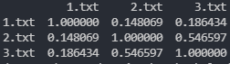

# Plagiarism-Checker<br />




# Download & Setup Instructions :
* Clone the project. This will download the GitHub respository files onto your local machine.</br>
```Shell
git clone https://github.com/teredet/Plagiarism-Checker
```
* Create a virtual environment and activate
```Shell
    pip install virtualenv
    python -m virtualenv envname
    envname\scripts\activate
```
* Install requirements
```Shell
    cd Plagiarism-Checker
    pip install -r requirements.txt
```
* Run program
```Shell
    python checker.py
```

# Tech Stack
* Python
* Pandas
* Sklearn
